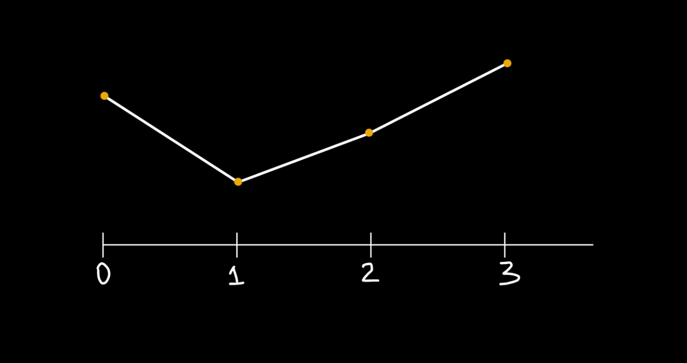
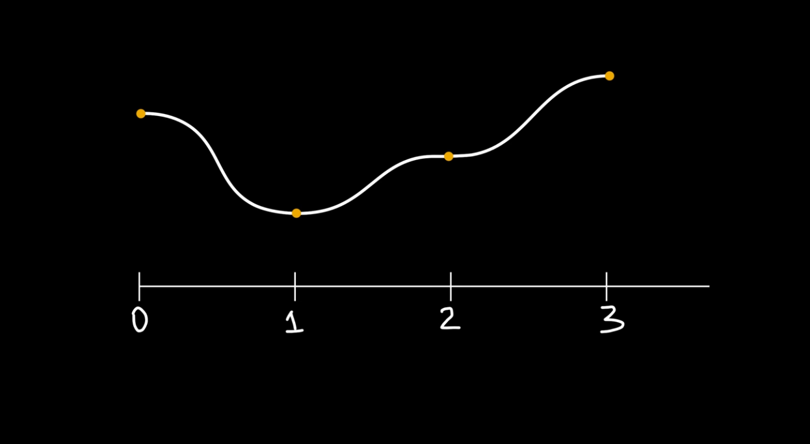
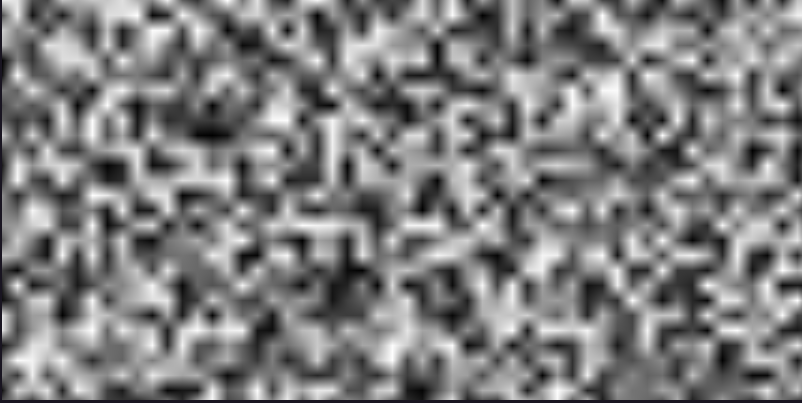
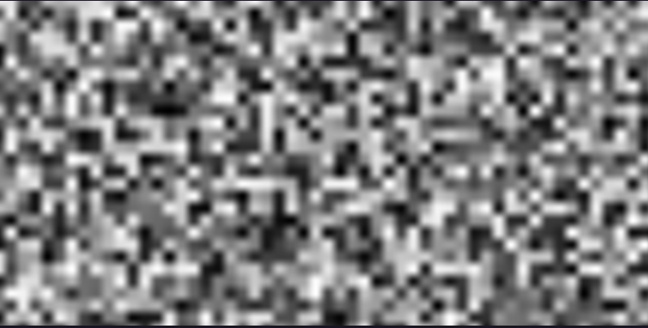
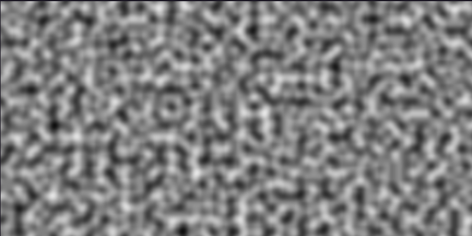
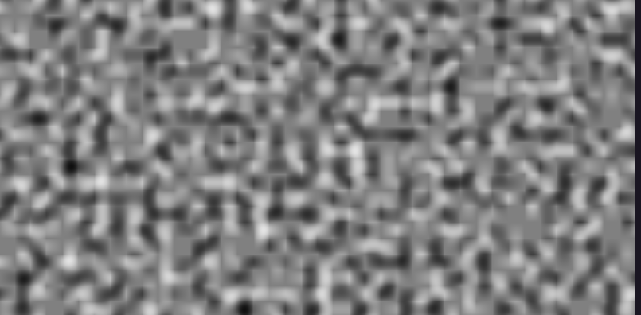
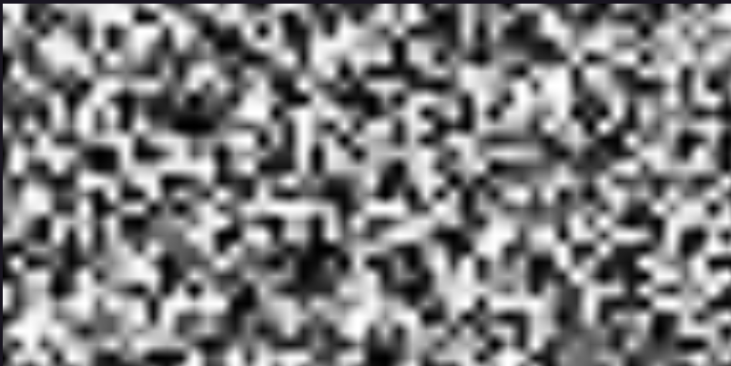

# Perlin Noise Implementation
## Value Noise
- This implementation follows [The Most Famous Algorithm In Computer Graphics](https://youtu.be/DxUY42r_6Cg?si=EMIpu-lsAuPtuw90) of creator Acerola. Currently we are implementing Value noise, the younger cousin of Perlin noise.

### What is Value Noise?
- A type of procedural noise commonly used in computer graphics, value noise is generated by first creating a grid or lattice of points and assigning a random, pre-computed value to each point. The noise value for any point in the space is then calculated by interpolating between the values of the surrounding grid points.

- In order to generate good noise textures, we need a good source of RNG, for this we utilize the PCG hash. PCG (Permuted Congruential Generator) hash functions are a family of pseudorandom number generators that offer an excellent balance of speed and statistical quality. They are particularly popular in applications like video games and computer graphics for procedural generation.

- The reason the RNG of PCG is called a hash in the implementation can be better explained here: [Hash Functions for GPU Rendering](https://www.reedbeta.com/blog/hash-functions-for-gpu-rendering/). The difference in semantics can be summed up to just for convenience, as this RNG is pseudorandom and, therefore, deterministic. The same input will always give the same output.

- In order to generate a noise texture, we use CMake to turn what we need into a texture executable before funneling the output into an image.ppm file, which can then be viewed.

### Process
- We address each pixel individually with whole integer coordinates of (x, y), we then scale these coordinates to obtain floating point types with which we can use to generate random numbers using PCG RNG.

- In order to reproduce the smooth transitions characteristic of value noise, two approaches are used:
    + Linear interpolation: This is to determine the value in between two other values. Since PCG only works with floating point numbers, we determine the fractional number in between 2 integers by interpolating with the below formula. This is often referred to in graphics as "lerp":

    noise(x) = hash($\lfloor x \rfloor$) + (x - $\lfloor x \rfloor$) * hash($\lceil x \rceil$) - hash($\lfloor x \rfloor$)

    + Smoothstep functions: The smoothstep function is a common tool in computer graphics for generating a smooth Hermite interpolation between two values, typically 0 and 1. It is characterized by the equation below:
    
    f(x) = $3x^2$ - $2x^3$

    -> Thesmoothstep's key feature is that its rate of change (slope or first derivative) is zero at both its start and end points. This prevents abrupt changes, ensuring a gentle "ease-in" and "ease-out."

    
    

### Result:
**The final result produces a grayscale texture that illustrates the value noise:**

The blending between extreme values can be seen with every black spot transitioning to white gradually, this can be improved with the smoothstep function

### What is Perlin noise
- Perlin noise is a gradient noise function developed by Ken Perlin in 1983. It's widely used in computer graphics and procedural content generation to create natural-looking, organic, or random textures, landscapes, and patterns. Unlike truly random noise, such as static, Perlin noise generates values that change smoothly across space. This means that nearby points will have similar noise values, which is key to producing the common "cloudy," "marbled," or "terrain-like" visual effects . It's a fundamental tool in simulating natural phenomena like smoke, fire, water, and complex terrains efficiently.

- The primary advantage of Perlin noise is its controllable pseudo-randomness. While appearing random, the output is deterministic; the same input coordinates will always produce the same noise value. This consistency is crucial for generating repeatable textures in games and visual effects. The smoothness and continuity of the noise are inherent to its design, which involves interpolating between a grid of random gradient vectors. This mathematical process avoids sharp discontinuities, resulting in the characteristic fluid appearance that makes it so useful for simulating organic systems.

- Perlin noise can be generated in any number of dimensions, though it's most commonly used in two dimensions (for 2D textures) or three dimensions (for 3D textures or volumes). Furthermore, complex, detailed patterns are often created by combining multiple layers of Perlin noise, each at a different frequency and amplitude. These combined layers are called octaves, and summing them up creates fractal noise or FBM (Fractional Brownian Motion), which provides the rich, detailed complexity seen in realistic virtual landscapes and materials.

### Process
- The computation of Perlin noise generally involves a three-step process. First, an invisible grid is established over the space, and at each grid intersection (lattice point), a fixed, pseudo-random gradient vector is assigned. Second, for any point P within a grid cell, the distance vectors from P to the surrounding lattice points are calculated. Third, the dot product is computed between each distance vector and the respective lattice point's gradient vector, yielding a set of scalar values.

- There is also a step in the middle where the fractional values are passed into an easing function to prevent harsh transitions. Without this step, the resulting texture has an overlapping grid-like pattern.

### Result
**The final result produces a grayscale texture that illustrates the Perlin noise:**

**Here is the result without the easing function:**

### The directional artifact issue
- Even with modern variations like Simplex noise (which addresses some of the artifacts), directional artifacts—a subtle grid-like bias in the resulting texture—are an inherent limitation of Perlin noise, regardless of the specific interpolation or gradient selection method used. These artifacts arise because the noise function is fundamentally based on a regular, underlying lattice (square or cubic grid) where the gradient vectors are fixed. When the noise is generated or "sampled" along directions perfectly aligned with or at 45∘ angles to this grid, the interpolation process can slightly favor those directions, creating a visual "ringing" or "stretching"  along the axes. While careful gradient selection and the use of smoother kernel functions minimize the visual impact, the geometric constraint of the underlying regular grid means that perfect rotational isotropy (where the texture looks the same regardless of orientation) is mathematically impossible to achieve with the Perlin algorithm's core structure.

## Introspection
- Due to a misunderstanding in how the process works, I ended up applying the smoothstep function to the final noise result after the lerping process instead of the fractional part of each of the coordinate. The original resulting texture ended up looking like this, which I wasn't able to recognize was wrong:

- This mistake was detected after observing abnormalities in the generated Perlin noise texture after smoothing

